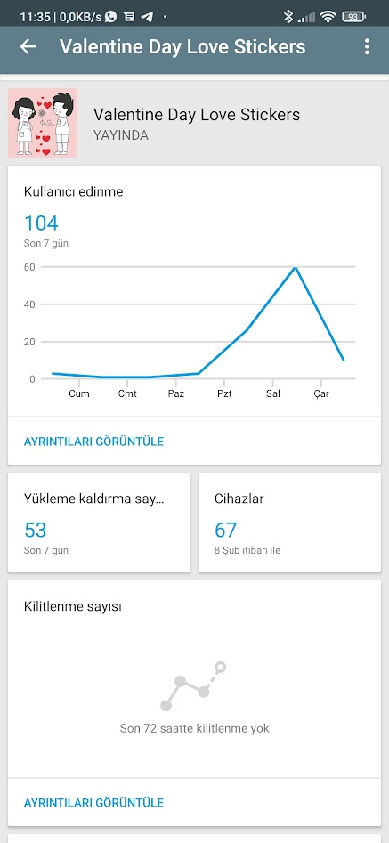
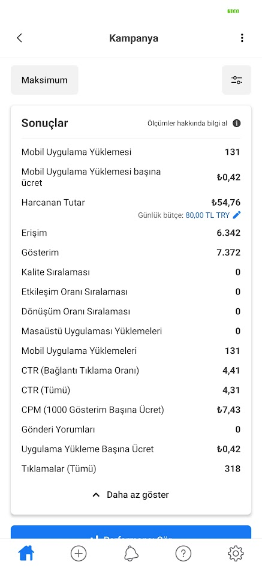
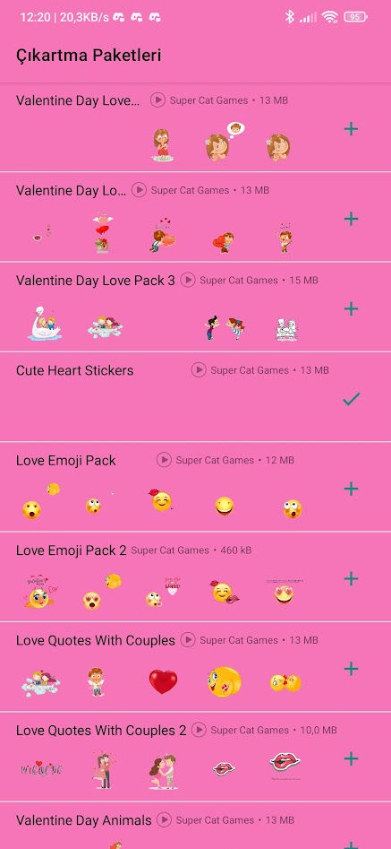
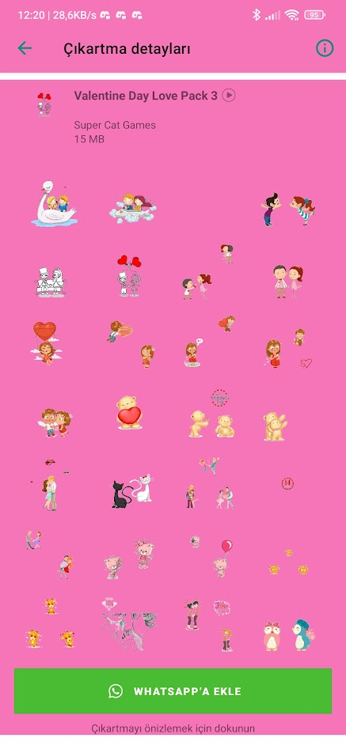

 
# ❤️ Love Stickers for WhatsApp (Valentine's Day Pack)

## Project Overview

This Android application was developed to provide a curated collection of romantic and Valentine's Day-themed sticker packs for WhatsApp users. Beyond software development, this project served as a **real-world case study in mobile app publishing and digital marketing**. 

The goal was not only to build a functional app but also to experiment with user acquisition strategies through paid advertising and analyze store performance metrics.

## Key Competencies Demonstrated

* **Android Development:** Built a native Android app integrating with WhatsApp's Sticker API.
* **Google Play Publishing:** Managed the full release lifecycle, including store listing optimization (ASO) and policy compliance.
* **User Acquisition (UA):** Executed a targeted **Facebook Ads campaign** to drive initial installs and validate market interest.
* **Data Analysis:** Monitored Cost Per Install (CPI) and conversion rates to optimize ad spend.
* **Analytics:** Tracked user growth and retention via Google Play Console.

## Performance Highlights

* **100+ Downloads:** Achieved over 100 active installs shortly after launch through a mix of organic search and paid campaigns.
* **Ad Campaign Management:** Successfully ran a low-budget campaign to test user acquisition costs (details in screenshots below).

## Tech Stack

* **Language:** Java
* **IDE:** Android Studio
* **Integration:** WhatsApp Sticker API
* **Monetization:** AdMob integration

## Project Status

The project successfully met its learning objectives regarding app deployment and marketing basics. It is currently retired from the Play Store.

---

## 📊 Project Analytics & Marketing Proof

Here, I document the "business" side of the project, demonstrating experience with real-world app metrics.

### 1. Facebook Ad Creative (Video/GIF Showcase)

*The creative asset used for the Facebook Ads campaign. This visual demonstrates the marketing content designed to attract users to the app.*

### 2. Google Play Console Data (Proof of Success)

*Google Play Console dashboard showing the growth trajectory, peaking at 100+ active installs during the campaign period.*

### 3. User Acquisition Experiment (Facebook Ads)

*Results from a targeted ad campaign. I analyzed metrics like "Cost Per Mobile App Install" (approx. 0.42 TL at the time) to understand the economics of app marketing.*

---

## 📱 App Screenshots

### Main Interface

*The main dashboard allowing users to browse and select from various themed sticker packs.*

### Sticker Pack Details

*Detail view showing the content of a sticker pack, ready to be added to WhatsApp.*

---

## License

This project is open-source for educational purposes.
